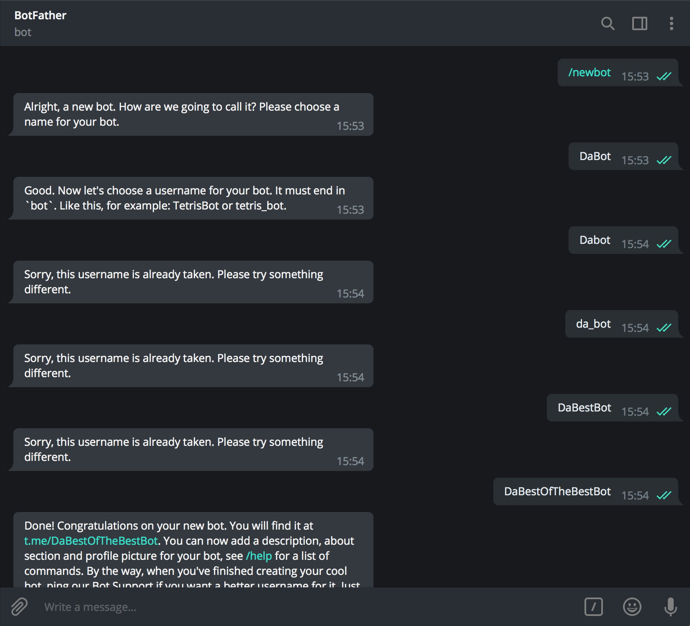

# WatsonTelegram 

A (very) simple Node.js Application to use IBM Watson Conversation with Telegram

## Before you begin

* Create an IBM Cloud account
    * [Sign up](https://console.ng.bluemix.net/registration/?target=/catalog/%3fcategory=watson) in IBM Cloud, or use an existing account. Your account must have available space for at least 1 app and 1 service.

* Make sure that you have the following prerequisites installed:
    * The [Node.js](https://nodejs.org/#download) runtime, including the [npm](https://www.npmjs.com/) package manager
    * A [Telegram](https://telegram.org/) Account (obviously)

          Note: Ensure that you Cloud Foundry version is up to date

## Create your Telegram Bot using Botfather

* Add @BotFather as a contact in Telegram

* Use the */newbot* instruction to create a new Bot. The BotFather will run you through the Bot creation process (The hardest part is finding the bot's username)

    

Your bot is now created !\
Save the token it gives you, you will need it later

## Create your Conversation instance on IBM Cloud

* Go to IBM Cloud and create a Watson Conversation service

* Create your new credentials and launch the tool 

* Create your a new workspace and get your Workspace ID

* To learn how to create a ChatBot with IBM Watson Conversation, please refer to the IBM Cloud documentation


## Configure the environment

* Rename the `.env.example` into `.env` (nothing before the dot) and paste your Telegram token and your Conversation Username, Password and Workspace ID.

## Installing and starting the app

1. Install the demo app package into the local Node.js runtime environment:

    ```bash
    npm install
    ```

1. Start the app:

    ```bash
    npm start
    ```

You can now interact with your Watson Conversation service via Telegram !!